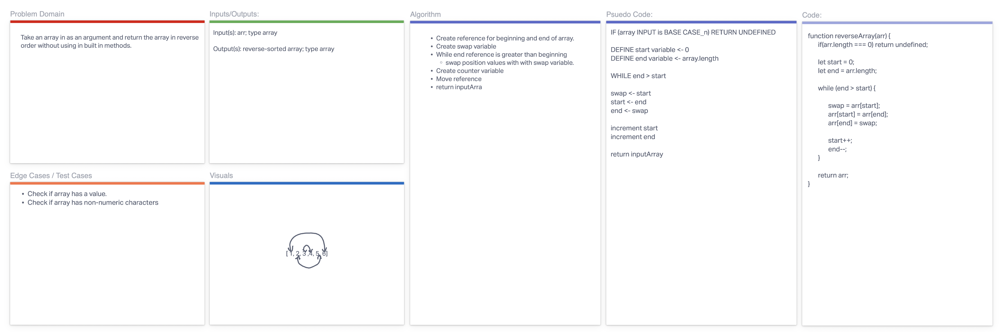

# Reverse an Array

  ```
    Whiteboard the approach to solving for reversing an array 
    in-place.
  ```

## Whiteboard Process

  - 

## Approach & Efficiency

  ```
    A while loop is used to iterate through the array once at 
    n = N / 2 => O(N).

    Best Case: O(N)
    Worst Case: O(N)
  ```
