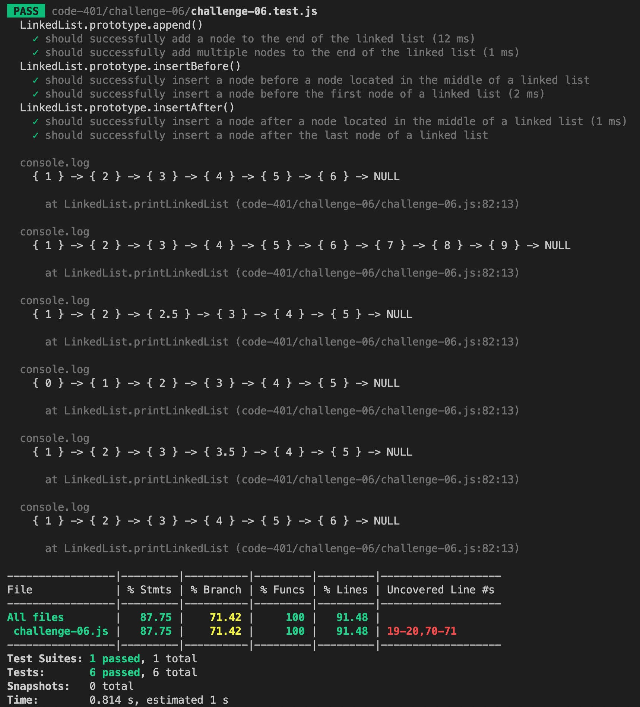

# Challenge 06: Extend a Linked List to allow various insertion methods.

## Description

1. Can successfully add a node to the end of the linked list
2. Can successfully add multiple nodes to the end of a linked list
3. Can successfully insert a node before a node located i the middle of a linked list
4. Can successfully insert a node before the first node of a linked list
5. Can successfully insert after a node in the middle of the linked list
6. Can successfully insert a node after the last node of the linked list

## Tests

