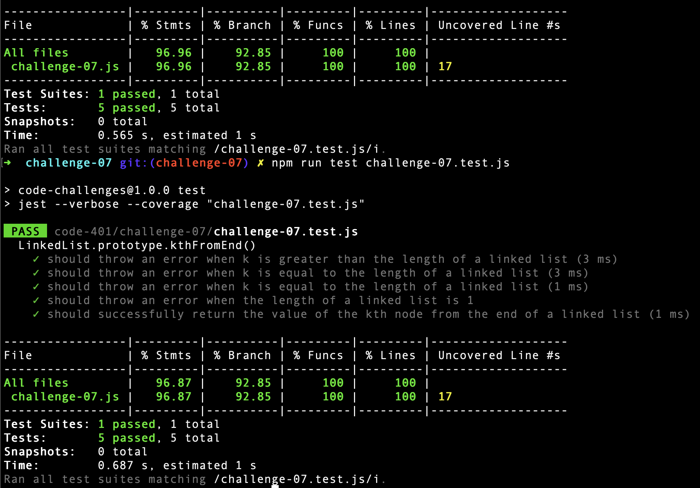

# Code Challenge 07: k-th value from the end of a linked list

## Description
kth from end
* argument: a number, k, as a parameter.
* Return the node’s value that is k places from the tail of the linked list.

## Solution

```javascript
'use strict';

class Node {
  constructor(value) {
    this.value = value;
    this.next = null;
  }
}

class LinkedList {
  constructor() {
    this.head = null;
  }

  getSize() {
    let size = 1;
    if (this.head === null) return 0;
    let node = this.head;
    while (node) {
      size++;
      node = node.next;
      if (node === null) size--;
    }
    return size;
  }

  kthFromEnd(k) {
    let size = this.getSize();
    if (size === 1) {throw new Error('linked list length is 1');}
    if (k > size) {throw new Error(`k argument is greater than linked list length`);}
    if (k === size) {throw new Error(`k argument is equal to linked list length`);}
    if (k < 1) {throw new Error('k argument must be positive');}
    
    let currentPosition = 0;
    let node = this.head;
    let kValue;

    while (node !== null) {
      currentPosition++;
      if (size - k === currentPosition) {
        kValue = node.value;
        break;
      }
      node = node.next;
    }
    return kValue;
  }

}
```

## Tests


