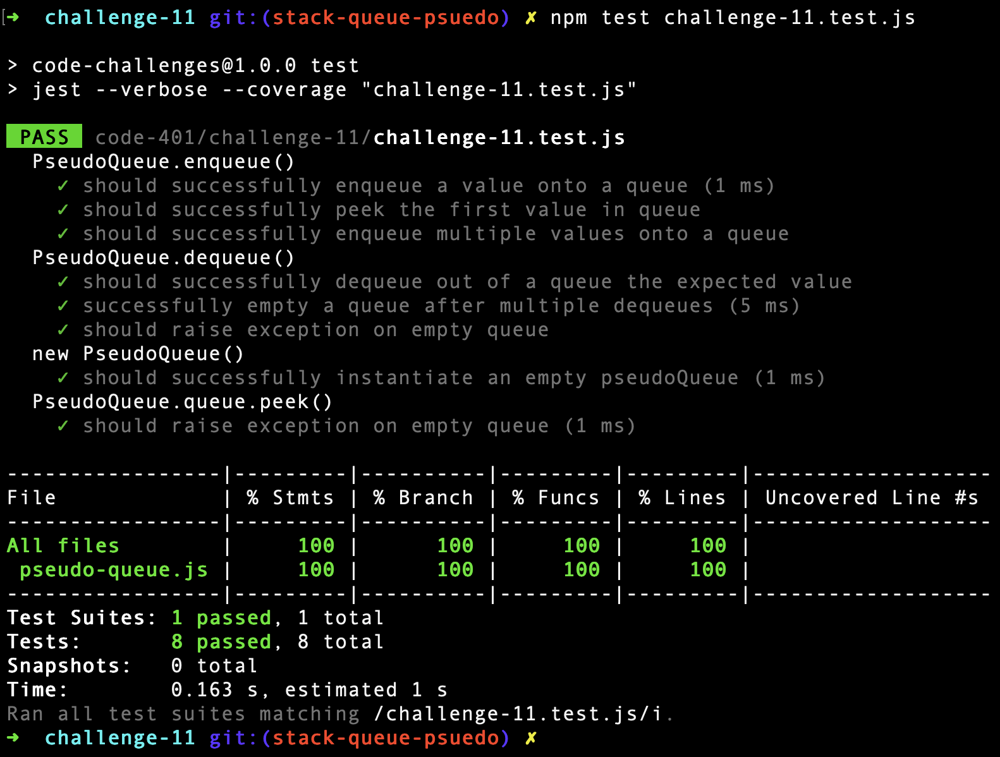

# Code Challenge: Class 11 - stack-queue-pseudo

Implementation of Stacks and Queues

## Challenge

Implement a Queue using two Stacks.

## Approach & Efficiency

1. Define PseudoQueue class as `this.stack` (input) and `this.queue` (output) - both are stacks (LIFO).
2. Push new nodes into stack; then pop nodes from input stack into output stack.

## JavaScript Data Structure

```javascript
class Node {
  constructor(value, next) {
    this.value = value;
    this.next = next;
  }
}

class Stack {
  constructor() {
    this.top = null;
  }

  push(value) {
    let node = new Node(value);
    node.next = this.top;
    this.top = node;
    return this.top;
  }

  pop() {
    if (!this.top) throw new Error('Nothing to remove!');
    let top = this.top.value;
    this.top = this.top.next;
    return top;
  }

  peek() {
    if (!this.top) throw new Error('Nothing to see here!');
    return this.top.value;
  }
}

class PseudoQueue {
  constructor() {
    this.stack = new Stack(),
    this.queue = new Stack()
  }
  enqueue(value) {
    this.stack.push(value);
    let node = this.stack.top;
    this.queue = new Stack();
    while (node) {
      this.queue.push(node.value);
      node = node.next;
    }
    return this.queue.top;
  }

  dequeue() {
    return this.queue.pop();
  }
}
```

## Testing


