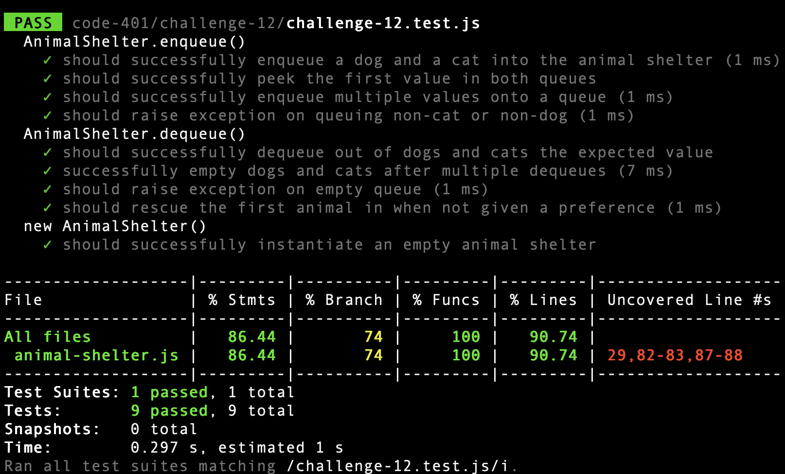

# Code Challenge: Class 12
## First-in First-out Animal Shelter

### Challenge Summary
* Create a class called AnimalShelter which holds only dogs and cats.
* The shelter operates using a first-in, first-out approach.
* Implement the following methods:
  * enqueue
    * Arguments: animal
animal can be either a dog or a cat object.
  * dequeue
    * Arguments: pref
    * pref can be either "dog" or "cat"
    * Return: either a dog or a cat, based on preference.
    * If pref is not "dog" or "cat" then return null.

### Approach & Efficiency

1. Create class AnimalShelter made up of two singly-linked lists with head and tail properties (dogs & cats).

2. "push" (enqueue) to either queue depending on preference and assign to tail.

3. "shift" (dequeue) from either queue depending on pref.

4. If no pref, get animal with earliest intake date.

### Solution

```javascript
const Chance = require('chance');
const chance = new Chance();

class Node {
  constructor(animal, name, intake_date, next) {
    this.animal = animal || null;
    this.name = name || chance.first();
    this.intake_date = intake_date || (new Date()).getTime();
    this.next = next || null;
  }
}

class Stack {
  constructor() {
    this.head = null;
    this.tail = null;
  }

  push(animal) {
    let node = new Node(animal);

    if (!this.head) {
      this.head = node;
      this.tail = node;
      return this.tail;
    }

    if (!this.tail) {
      this.tail = node;
    } else {
      this.tail.next = node;
      this.tail = node;
    }
    return this.tail;
  }

  shift() {
    if (!this.head) throw new Error('No animal to rescue!');
    if (this.head === this.tail) {
      let node = this.head;
      this.head = null;
      this.tail = null;
      return node;
    }
    let head = this.head;
    this.head = this.head.next;
    return head;
  }

  peek() {
    if (!this.head) return null;
    return this.head;
  }

}

class AnimalShelter {
  constructor() {
    this.dogs = new Stack();
    this.cats = new Stack();
  }
  enqueue(animal) {
    if (animal === 'dog') {
      this.dogs.push(animal);
      return this.dogs.tail;
    } else if (animal === 'cat') {
      this.cats.push(animal);
      return this.cats.tail;
    } else {
      throw new Error('Animal must be either a cat or a dog!');
    }
  }

  dequeue(pref) {
    if (pref === null || pref === undefined || (pref !== 'dog' && pref !== 'cat')) {

      if (this.dogs.peek() === null && this.cats.peek() === null) throw new Error('No animal to rescue!');
      if (this.dogs.peek() === null) {
        if (this.cats.peek() === null) throw new Error('No animal to rescue!');
        return this.cats.shift();
      } else if (this.cats.peek() === null) {
        if (this.dogs.peek() === null) throw new Error('No animal to rescue!');
        return this.dogs.peek();
      };
      
      if (Number(this.dogs.peek().intake_date) < Number(this.cats.peek().intake_date) || this.cats.peek() === null) {
        return this.dogs.shift();
      } else if (Number(this.cats.peek().intake_date) < Number(this.dogs.peek().intake_date) || this.dogs.peek() === null) {
        return this.cats.shift();
      }
    }

    if (pref === 'dog') {
      return this.dogs.shift();
    } else {
      return this.cats.shift();
    }
  }
}

module.exports = { Node, Stack, AnimalShelter };
```

