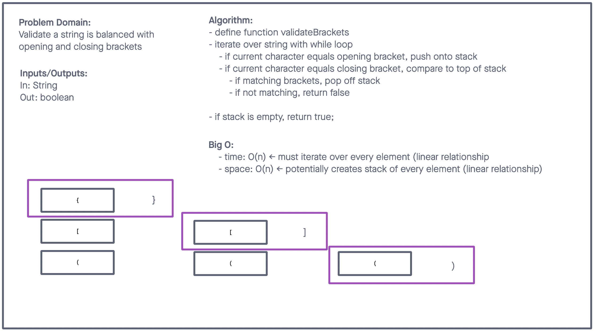
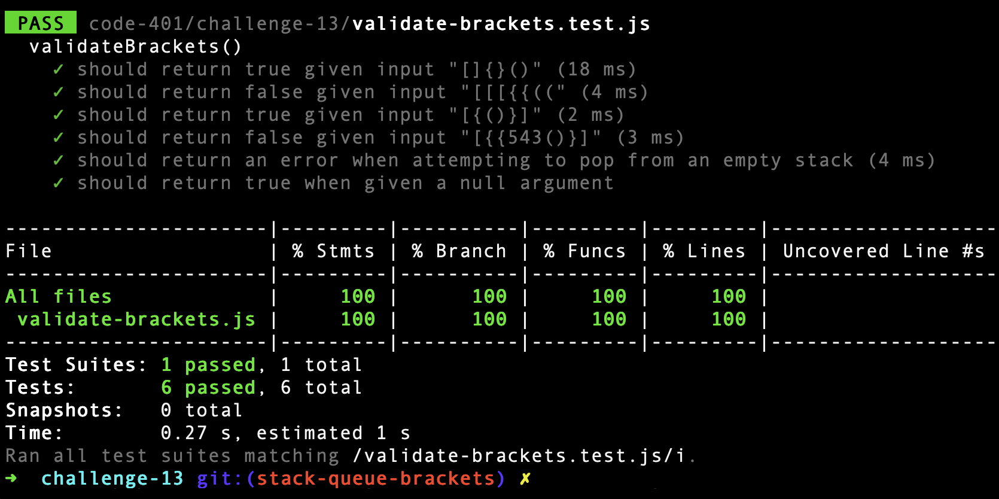

# CodeChallenge: Class 13


## Challenge Summary

* Write a function called validate brackets
* Arguments: string
* Return: boolean
    * representing whether or not the brackets in the string are balanced

## Whiteboard Process



## Approach & Efficiency

* Use stack to store opening brackets (nodes)
* compare top (LIFO) to current character if closing.

## Solution

```javascript
'use strict';

class Node {
    constructor(value) {
        this.value = value;
        this.next = null;
    }
}

class Stack {
    constructor() {
        this.top = null;
    }

push(value) {
    let node = new Node(value);

    if (this.top === null) {
        this.top = node;
    } else {
        node.next = this.top;
        this.top = node;
    }
    return this.top.value;
}

pop() {
    if (this.top === null) throw new Error('Nothing to pop!');
    let top = this.top;
    this.top = this.top.next;
    return top.value;
}

peek() {
    return this.top.value;
}

isEmpty() {
    if (this.top === null) return true;
    return false;
}

print() {
    let node = this.top;
    let nodeString = '';
    while (node) {
        nodeString += `{ ${node.value} } -> `;
        node = node.next;
    }
    nodeString += 'NULL'
    console.log(nodeString);
}
}

function validateBrackets(str) {
    if (str === null || str === '' || str === undefined) return true;

    const openBrackets = ['{','(','['];
    const closeBrackets = ['}',')',']'];

    let brackets = new Stack();
    let i = 0;

    while (i < str.length) {

        if (openBrackets.includes(str[i])) brackets.push(str[i]);
        brackets.print();

        if (closeBrackets.includes(str[i])) {
            if (closeBrackets.indexOf(str[i]) === openBrackets.indexOf(brackets.peek())) {
                brackets.pop();
            } else {
                return false;
            }
        }
        i++;
    }
    return brackets.isEmpty();
}
```

## Testing


