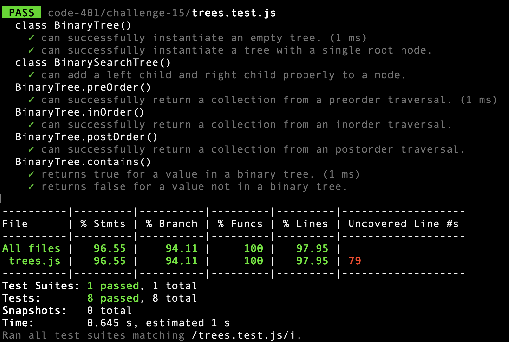

# Trees

## Challenge

### Node

* Create a Node class that has properties for the value stored in the node, the left child node, and the right child node.

### Binary Tree

* Create a Binary Tree class

    * Define a method for each of the depth first traversals:
pre order
* in order
* post order which returns an array of the values, ordered appropriately.

### Binary Search Tree

* Create a Binary Search Tree class
    * This class should be a sub-class (or your languages equivalent) of the Binary Tree Class, with the following additional methods:

    * Add

        * Arguments: value

        * Return: nothing

        * Adds a new node with that value in the correct location in the binary search tree.

    * Contains

        * Argument: value

        * Returns: boolean indicating whether or not the value is in the tree at least once.

## Approach & Efficiency

1. Create Node Class
2. Create BinaryTree Class
3. Create BinarySearchTree Class
4. Iterate over binary tree for traversing methods
5. Iterate over binary tree for add and search methods

* Big O:
    * Time: O(log N); search patterns divide the number of nodes to search in two at each level.

    * Space: O(N); traverse methods return arrays dependent on the number of nodes.

## Testing

