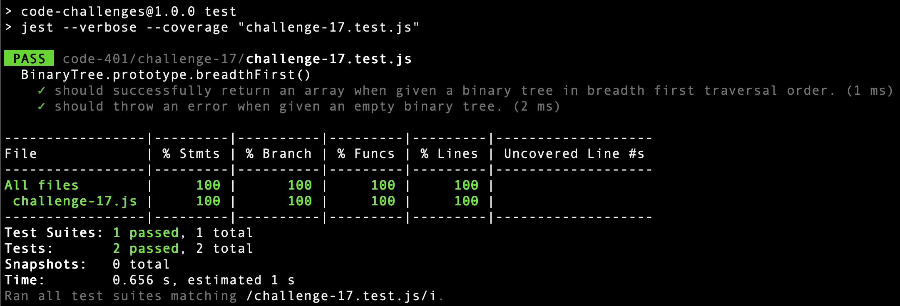

# Code Challenge 17: Breadth-first Traversal

## Description
* Write a function called breadth first
* Arguments: tree
* Return: list of all values in the tree, in the order they were encountered


## Solution

```javascript
class Node {
  constructor(value) {
    this.value = value;
    this.left = null;
    this.right = null;
  }
}

class BinaryTree {
  constructor() {
    this.root = null;
  }

  breadthFirst() {
    if (this.root === null) throw new Error('Error: empty tree.');
    
    let queue = [];
    let results = [];

    let root = this.root;
    let parent, children;
    queue.push(root);
    results.push(root.value);
    while (queue.length > 0) {
    
      parent = queue.splice(0, 1)[0];

      children = [];
      if (parent.left !== null) children.push(parent.left);
      if (parent.right !== null) children.push(parent.right);

      for (let child of children) {
        queue.push(child);
        results.push(child.value);
      };
    }
    
    return results;
  }
}
```

## Tests


```javascript
'use strict';
const { Node, BinaryTree } = require('./challenge-17');
const tree = new BinaryTree();
const emptyTree = new BinaryTree();

beforeAll(() => {
  tree.root = new Node(2);
  tree.root.left = new Node(7);
  tree.root.right = new Node(5);
  tree.root.left.left = new Node(2);
  tree.root.left.right = new Node(6);
  tree.root.right.right = new Node(9);
  tree.root.left.right.left = new Node(5);
  tree.root.left.right.right = new Node(11);
  tree.root.right.right.left = new Node(4);
});

describe('BinaryTree.prototype.breadthFirst()', () => {
  it('should successfully return an array when given a binary tree in breadth first traversal order.', () => {

    expect(tree.breadthFirst()).toEqual([2, 7, 5, 2, 6, 9, 5, 11, 4]);
  });
  it('should throw an error when given an empty binary tree.', () => {

    expect(() => { emptyTree.breadthFirst() }).toThrowError('Error: empty tree.');
  });
});
```

