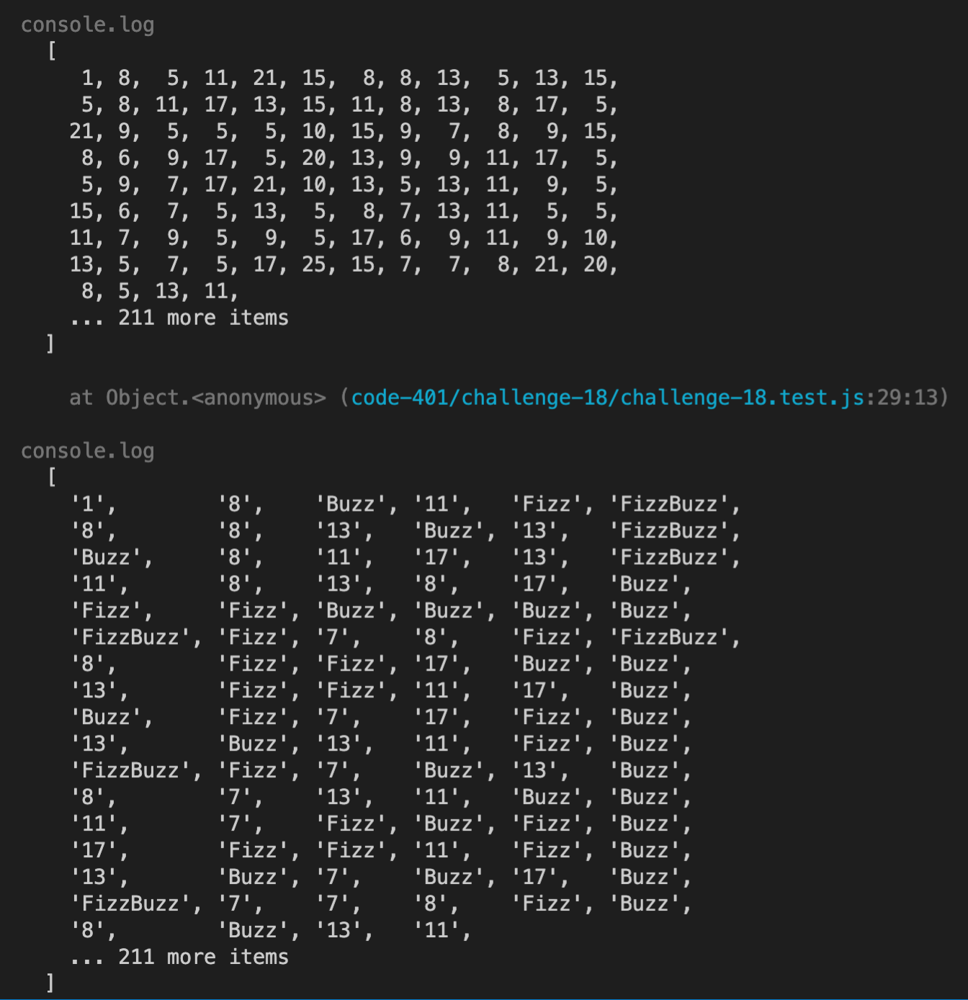

# CodeChallenge: Class 13

## Challenge Summary

### Feature Tasks
* Write a function called fizz buzz tree
* Arguments: k-ary tree
* Return: new k-ary tree

Determine whether or not the value of each node is divisible by 3, 5 or both. Create a new tree with the same structure as the original, but the values modified as follows:

* If the value is divisible by 3, replace the value with “Fizz”
* If the value is divisible by 5, replace the value with “Buzz”
* If the value is divisible by 3 and 5, replace the value with “FizzBuzz”
* If the value is not divisible by 3 or 5, simply turn the number into a String.

## Whiteboard Process


## Approach & Efficiency


## Solution

```javascript
'use strict';

class Node {
  constructor(value) {
    this.value = value;
    this.children = [];
  }
}

class KaryTree {
  constructor() {
    this.root = null;
  }

  treeToArray() {
    let result = [];
    let queue = [];
    let parent;
    queue.push(this.root);
    let n = queue.length;
    while (n > 0) {
      n = queue.length;
      for (let i = 0; i < n; i++) {
        parent = queue.shift();
        result.push(parent.value); 
        for (let child of parent.children) {
          queue.push(child)
          result.push(child.value); 
        }
      }
    }
    return result;
  }

  fizzBuzzNode(value) {
    let str = '';
    if (typeof value === 'string') return value;
    if (value % 3 === 0) str += 'Fizz';
    if (value % 5 === 0) str += 'Buzz';
    if (value % 3 !== 0 && value % 5 !== 0) str += String(value);
    return str;
  }

  fizzBuzzTree() {
    if (!this.root) return null;

    let tree = this;
    let root = tree.root;

    let queue = [];
    let parent;

    queue.push(root);

    let n = queue.length;

    while (n > 0) {

      n = queue.length;

      for (let i = 0; i < n; i++) {

        parent = queue.shift();        
        parent.value = this.fizzBuzzNode(parent.value);

        for (let child of parent.children) {

          queue.push(child)
          child.value = this.fizzBuzzNode(child.value);

        }
      }
    }
    return tree;
  }

}

module.exports = { Node, KaryTree };
```

## Testing


