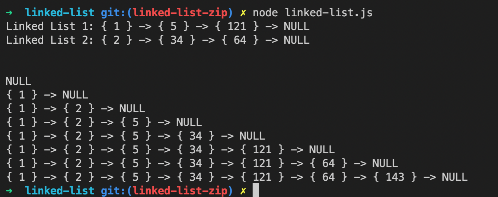

# Zipped Linked Lists
Testing for construction and traversing of linked list. 

## Challenge
Zip two Linked Lists

## Approach & Efficiency
1. Create function zipLists
2. Create List Marker Variable (i.e. 1 for List 1, 2 for List 2)
3. Create new Linked List and two markers for input list heads
4. Assign head of new linked lists to list 1 head.
5. Iterate over both lists with list marker.
6. Add current list node to end of new list.

## Solution

